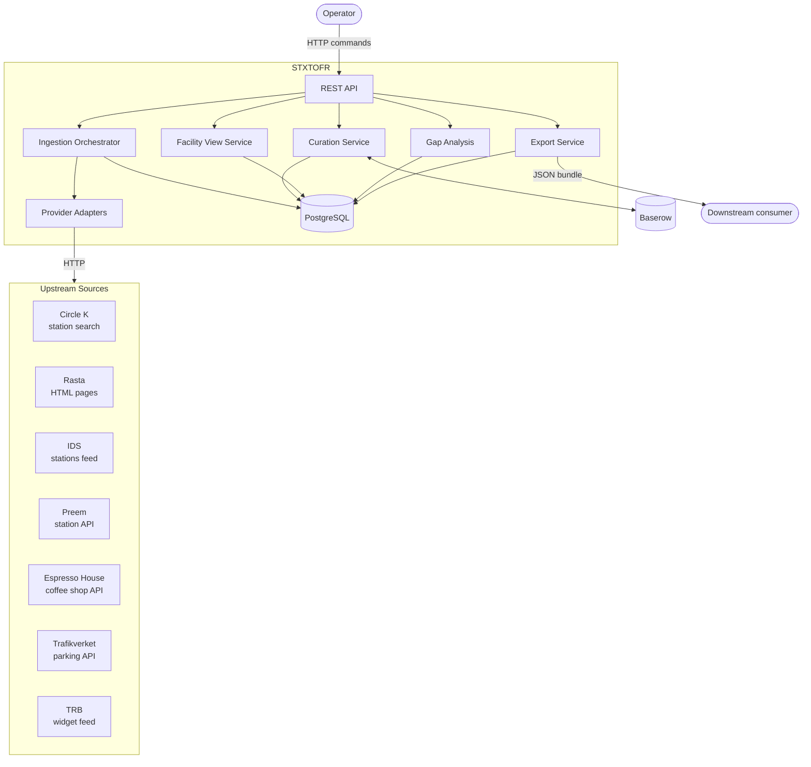
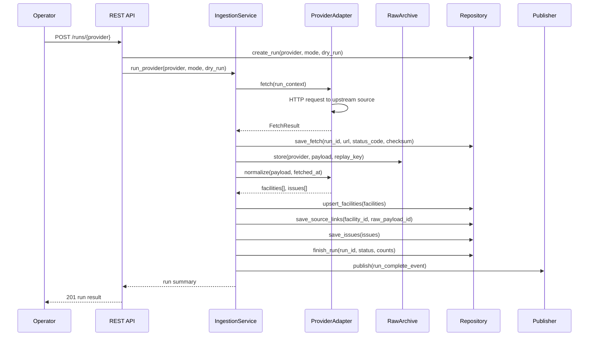
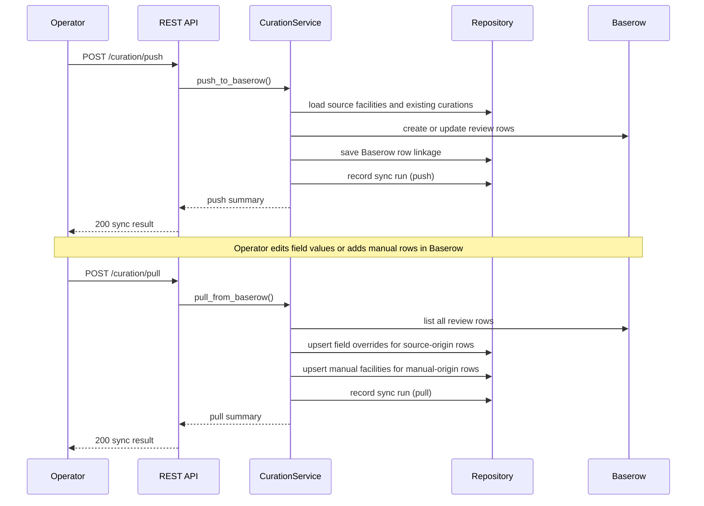
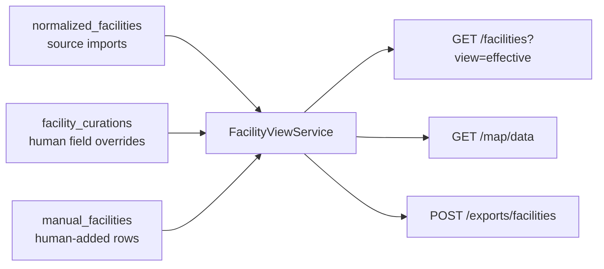
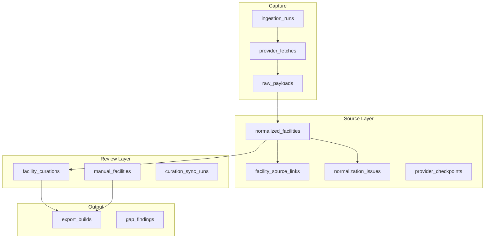
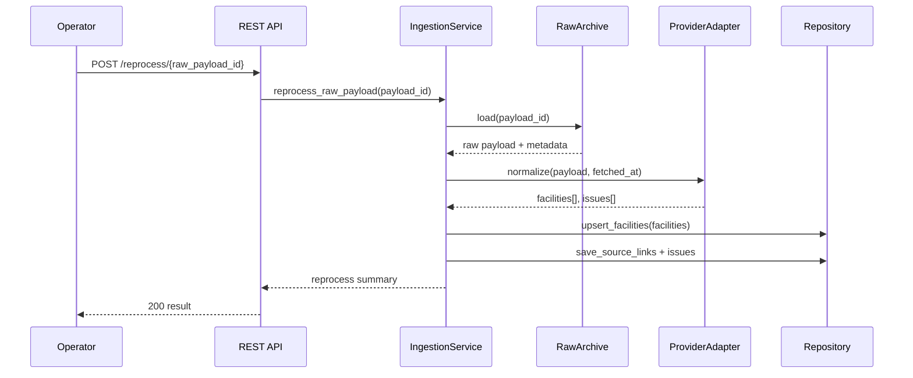

# STXTOFR Architecture

STXTOFR is a multi-source ETL service for Swedish roadside facility data. Provider adapters fetch upstream data through HTTP, normalise records into a shared facility model, and persist the output to PostgreSQL. A human review layer via Baserow allows field-level corrections before the final dataset is assembled and exported as a versioned JSON bundle.

## System Context



## ETL Pipeline

Each import run follows a fixed pipeline. The raw payload is archived before normalisation so any run can be replayed without a live network call.

```mermaid
flowchart TD
    A[POST /runs or POST /runs/{provider}] --> B[IngestionService]
    B --> C[adapter.fetch]
    C --> D{HTTP\nok?}
    D -- no --> E[mark run failed\nlog error]
    D -- yes --> F[archive raw payload]
    F --> G[adapter.normalize]
    G --> H[upsert source facilities]
    H --> I[save source links\nand normalization issues]
    I --> J[finish run\nrecord counts]
    J --> K[publish run event]
```

## Import Run Sequence



## Curation Roundtrip

Baserow is used as the editing surface. STXTOFR pushes review rows out and pulls approved edits back. Human corrections are stored as discrete override rows and applied on top of the source layer when assembling the effective dataset.



## Effective Dataset Assembly

The effective dataset is assembled at query time. Human override values win over imported source values for any field that was corrected. Manual-only facilities are appended and never overwrite source rows.



## Storage Schema



## Replay Flow

Any archived raw payload can be reprocessed without a live network call. This allows normalization fixes to be applied retroactively without re-fetching upstream sources.


